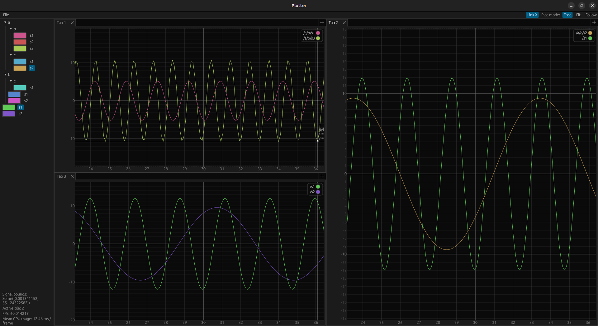

# Rust Data Inspector

A flexible library to plot time series in real time.

## Features
- Flexible: Easily select which signals you want to plot in each tab
- Fast: can display signals with millions of samples effortlessy
- Customizable UI trough [egui_dock](https://github.com/Adanos020/egui_dock)

## Examples
See `examples/sine_waves.rs`